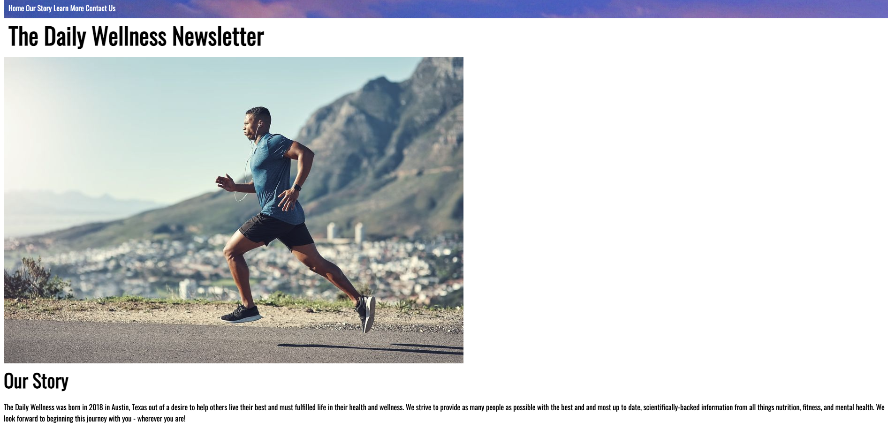

# mini-project-1

## Description

The goal of this challenge was to create a basic landing page including semantic HTML elements, header navigation, forms, and some stylistic CSS formatting.
This was a great challenge in learning some trial and error tools to build the foundations of a webpage and putting together some functional tools to make an 
accessible and helpful website.

## Usage

Please view in GitHub pages: https://samocain93.github.io/mini-project-1/
